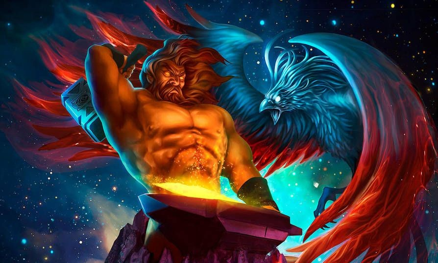

# 🔥 Hephaestus Bot 🔥

> Hephaestus is a newly developed bot for Discord made using the discordJS Library. This is my first bot I have developed so some of the code could be optimised and improved upon.

 
[Artwork credit to Luisagiliberti on DeviantArt](https://www.deviantart.com/luisagiliberti)
 
## Music Player 🎼
The music playing functionality for Hephaestus requires an interaction between your client and the YoutubeAPI. This is so the bot can get information on specific videos and play them successfully

The implementation of the music player was made possible by the [discord-player](https://github.com/Androz2091/discord-player) library provided by GitHub user @Androz2091. Full credit for the functionality of the discord-player module goes to them. Go check out their library.

## Moderation 🔨
This bot has some moderation features. With time will come further updates expanding Hephaestus' capabilities in managing your Discord Server but right now, Hephaestus, has support for kicking and banning aswell as role management.

## Dynamic Implementation of Commands
The most useful implementation which I have made with Hephaestus is my dynamic commands and their command handler.

As you can see from the directory, their is the main `bot.js` file accompanied by a `commands folder`. Every Javascript file in the commands folder is a separate command and the main command handler in the `bot.js` file iterates through this folder adding each command and its name to a map within the `client` class.

```javascript

45 - for (const file of commandFiles) {
46 -    const command = require(`./commands/${file}`);
47 -    client.commands.set(command.name, command);
48 - }
```

The command handler then proceeds on to use a try/catch statement in order to attempt the execution whilst providing informative error handling to the Terminal and End User upon an error

```javascript
107 - try {
108 -     command.execute(message, args);
109 - } catch (error) {
110 -    console.error(error);
111 -    message.reply('there was an error trying to execute that command!');
112 - }
```
## Release History ⌚

* 1.0
   * RELEASED: Music Player and Basic Moderation
* 1.1
   * PLANNED UPDATE: Further moderation commands

## Information on Dev
Donald Jennings - [@donald_jenningz](https://twitter.com/donald_jenningz) - donald.jennings2020@gmail.com

[https://github.com/DonaldJennings/Hephaestus-Bot](https://github.com/DonaldJennings)
